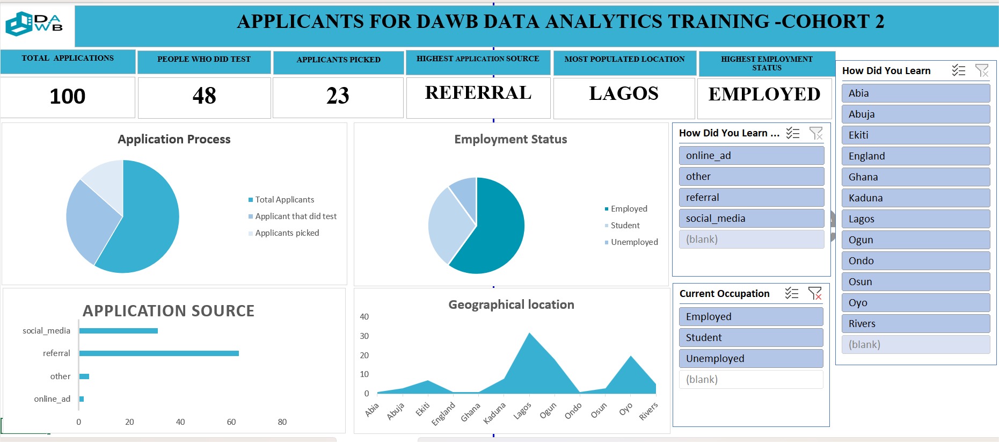
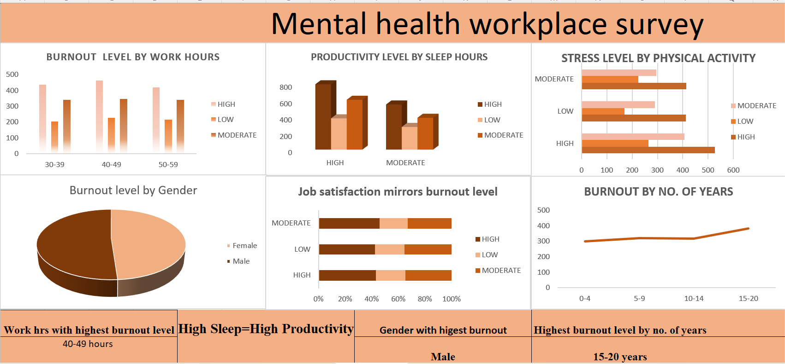

# Ayodamope-vitalytics.github.io
Welcome,I’m a data analyst with a background in nursing, passionate about turning health and human-centered data into actionable insights.

##About Me
I specialize in data cleaning, visualization, and reporting using Excel, SQL, and Power Bi## Projects
### 📊 Project 1: Lifestyle and health prediction analysis
**Description:**-	Analyzed real-world datasets across variables like employment, marital status, education, alcohol use, diet, and chronic illnesses.
**Tools Used:** Excel, Power BI
**Key Findings:**
-	Generated descriptive and predictive insights to evaluate health-seeking behavior, dietary risk, and prevalence of chronic conditions 
-	Created dynamic dashboards to visualize lifestyle factors and their influence on sleep patterns and mental health 
-	Delivered prescriptive recommendations to improve wellness outcomes in target populations 
[View Project Files →](https://eu.docworkspace.com/d/cIEPAoLJg6LquxwY?sa=S0&st=0)

### Project Dashboard Preview
![Dashboard Lifestyle and Health prediction Analysis ])()()

### 📈 Project 2: Fashion Product Sales Trend Analysis 
**Description:** -	Cleaned and structured sales data from a fashion brand to identify best-selling product categories and seasonal performance 

**Tools Used:** Excel, Power BI

**Key Findings:**
- NIKE emerged as both the most listed and most expensive brand, reflecting a strong consumer preference for premium labels.
- Neutral colors such as black, white, and beige were the most purchased across all categories.
- Larger sizes (L–XXL) recorded higher purchase volumes compared to smaller sizes.
- Sweaters received the highest average customer ratings, indicating strong satisfaction and product performance.
[View Project Files →](https://eu.docworkspace.com/d/cILTAoLJgtbuuxwY?sa=S0&st=0)

### Project Dashboard Preview
) 

### 📊 Project 3: APPLICANTS FOR DAWB DATA ANALYTICS TRAINING-COHORT 2
**Description:**-It presents an analysis of 100 applicants from the DAWB Data Analytics Training (Cohort 2), highlighting key insights from application sources, employment status, selection process, and geographic reach.

**Tools Used:** Excel,
**Key Findings:**

 -📊 Application Process: Out of 100 applicants, only 23 advanced to selection, showing DAWB’s strong emphasis on quality and readiness.

-🧭 Application Source: Referrals brought in the highest number of applicants, followed by social media. The DAWB community believes in and promotes the program — that’s true impact!

-💻 Employment Status: Most applicants are employed professionals, reflecting a growing interest in using data skills to enhance career growth.

-🌍 Geographic Spread: Lagos and the Southwest region dominate participation, showing DAWB’s strong regional influence and room to reach other zones.
 
[View Project Files →](https://eu.docworkspace.com/d/cIILAoLJg7Z6ByQY?sa=S0&st=0))

### Project Dashboard Preview
) 

### 📊 Project 4:Mental health workplace survery
**Description:**-This project analyzes workplace burnout using a multi-dimensional dataset covering work hours, sleep duration, physical activity, years of experience, gender, and productivity metrics. I designed a comprehensive dashboard visualization to communicate patterns and risk factors contributing to employee burnout.

**Tools Used:** Excel
**Key Findings:**

-Those working between 40–49 hours per week reported the highest burnout levels. It wasn’t the people working the longest hours — it was those in the “almost too busy” range. Sometimes, burnout doesn’t happen at the extreme; it creeps in when you think you’re still managing fine.

-There was only a small difference between male and female employees, but men showed slightly higher burnout levels. It’s a reminder that burnout has no respect for gender — it affects anyone, no matter how strong or composed they appear.

-People who get more sleep have higher productivity — rest isn’t a luxury; it’s an efficiency tool.

-Employees with the longest years of service had the highest burnout levels — loyalty shouldn’t lead to depletion.

-Those who engage in more physical activity report lower stress — small steps literally make a big difference.

-The more burnout increases, the less satisfied people feel with their jobs — when well-being declines, so does engagement.
[View Project Files →](https://eu.docworkspace.com/d/cIPDAoLJgrKqByQY?sa=S0&st=0))

### Project Dashboard Preview
)

- **Data Analysis:** Excel (Advanced), Google Sheets, Power BI
- **Databases:** SQL, MySQL
- **Visualization:** Excel, Power BI
- **Other:** Data cleaning, Statistical analysis, Reporting

## Contact
- 📧 Email: dapwincess4@gmail.com
- 💼 LinkedIn: [Ayodamope-vitalytics linkedin](http://www.linkedin.com/in/ayodamope-adesiyan-38b29b24a)

